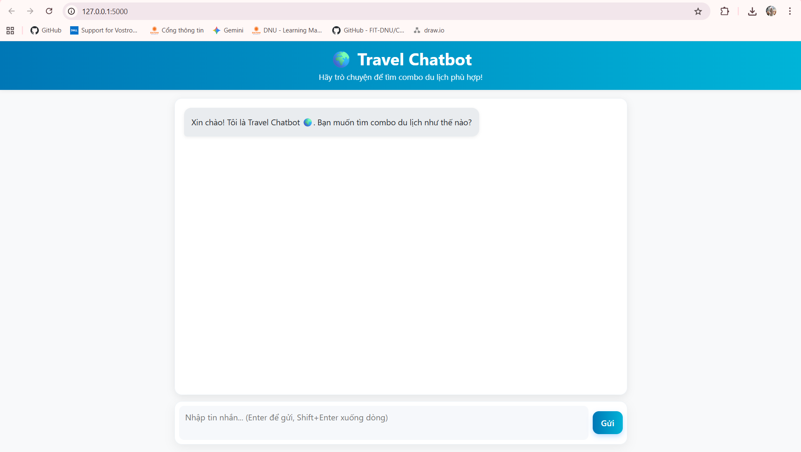
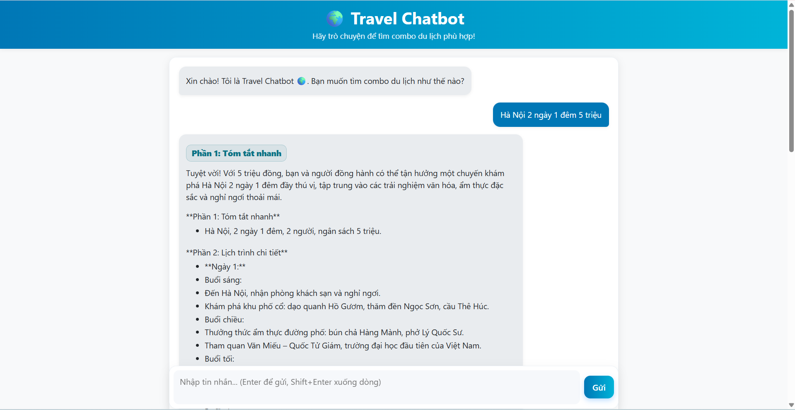

# Chatbot AI Gợi ý Combo Du lịch 🌍

<p align="center">
  
  
</p>

Dự án **Travel Chatbot** được xây dựng bằng **Python (Flask)**, tích hợp **Google Gemini API** để gợi ý các combo du lịch theo ngân sách, sở thích và thời gian.  
Chatbot cung cấp lịch trình chi tiết, khách sạn, di chuyển, ăn uống và ước tính chi phí.

<p align="center">
  
  
  
</p>

---

## 📋 Mục lục
- [✨ Tính năng chính](#-tính-năng-chính)
- [🛠 Công nghệ sử dụng](#-công-nghệ-sử-dụng)
- [📁 Cấu trúc dự án](#-cấu-trúc-dự-án)
- [🚀 Hướng dẫn cài đặt](#-hướng-dẫn-cài-đặt)
- [📖 Hướng dẫn sử dụng](#-hướng-dẫn-sử-dụng)
- [🖼 Hình ảnh ứng dụng](#-hình-ảnh-ứng-dụng)
- [© Bản quyền](#-bản-quyền)

---

## ✨ Tính năng chính
- Chatbot gợi ý combo du lịch theo yêu cầu người dùng.
- Câu trả lời có cấu trúc: **Tóm tắt → Lịch trình → Khách sạn → Di chuyển → Ăn uống → Chi phí → Mẹo tiết kiệm**.
- Hỗ trợ tiếng Việt, định dạng dễ đọc (bullet points).

---

## 🛠 Công nghệ sử dụng
- **Ngôn ngữ:** Python 3.10+
- **Backend:** Flask
- **AI API:** Google Gemini (Generative AI)
- **Frontend:** HTML5, CSS3, Bootstrap, Jinja2
- **Quản lý API Key:** dotenv (`.env`)

---

## 📁 Cấu trúc dự án
```bash
TravelChatbot/
├── templates/
│   └── index.html            # Giao diện chính
├── app.py                    # Flask app (Chatbot)
├── .env                      # API key (GEMINI_API_KEY)
├── api key.txt               # Lưu API key (không khuyến nghị)
└── requirements.txt          # Thư viện cần cài
```

---

## 🚀 Hướng dẫn cài đặt
1. 🔽 Clone repository:
   ```bash
   git clone https://github.com/your-repo/TravelChatbot.git
   cd TravelChatbot
   ```

2. 🛠 Tạo môi trường ảo:
   ```bash
   python -m venv venv
   venv\Scripts\activate   # Windows
   source venv/bin/activate  # Linux/Mac
   ```

3. 📦 Cài đặt thư viện:
   ```bash
   pip install -r requirements.txt
   ```

4. 🔑 Cấu hình API key trong file `.env`:
   ```
   GEMINI_API_KEY=your_api_key_here
   ```

5. 🚀 Chạy ứng dụng:
   ```bash
   python app.py
   ```

6. 🌐 Truy cập tại: [http://127.0.0.1:5000](http://127.0.0.1:5000)

---

## 📖 Hướng dẫn sử dụng
1. Nhập yêu cầu combo du lịch (ví dụ: “Đi Đà Nẵng 2 ngày 1 đêm 2 người, ngân sách 5 triệu”).  
2. Chatbot sẽ trả về gợi ý theo 7 phần: **Tóm tắt → Lịch trình → Khách sạn → Di chuyển → Ăn uống → Chi phí → Mẹo**.  
3. Người dùng có thể tiếp tục trò chuyện để tinh chỉnh gợi ý.  

---

## 🖼 Hình ảnh ứng dụng
**💬 Giao diện Chatbot:**


**💬 Người dùng nhập câu hỏi:**


**💬 Chatbot trả lời:**


---

## © Bản quyền
© 2025 **Vương Thị Nhung CNTT - 1704** - Dự án Travel Chatbot  
📧 Email liên hệ: [vuongthinhung2005@gmail.com](mailto:vuongthinhung2005@gmail.com)
