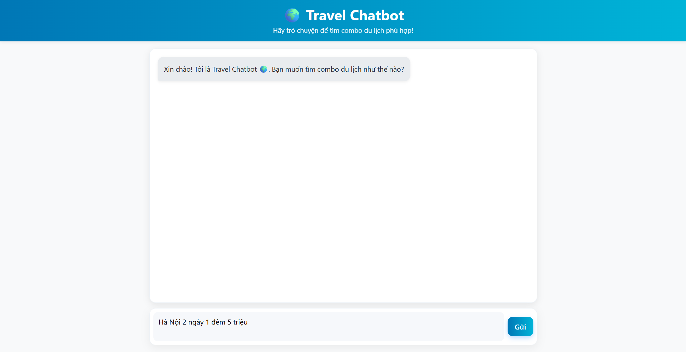

<!DOCTYPE html>
<html lang="vi">
<head>
    <meta charset="UTF-8">
</head>
<body>
    <h1 align="center">Chatbot AI Gợi ý Combo Du lịch</h1>
     

        
        
    

    
Dự án <strong>Travel Chatbot</strong> được xây dựng bằng <strong>Python (Flask)</strong>, tích hợp <em>Google Gemini API</em> để gợi ý các combo du lịch theo ngân sách, sở thích và thá»i gian. 
    Chatbot cung cấp lịch trình chi tiết, khách sạn, di chuyển, ăn uống và ước tính chi phí.

    

        
        
        
    

    <h2>📋 Mục lục</h2>
    <ul>
        <li><a href="#features">Tính năng chính</a></li>
        <li><a href="#tech">Công nghệ sử dụng</a></li>
        <li><a href="#structure">Cấu trúc dự án</a></li>
        <li><a href="#install">Hướng dẫn cài đặt</a></li>
        <li><a href="#usage">Hướng dẫn sử dụng</a></li>
        <li><a href="#screenshots">Hình ảnh ứng dụng</a></li>
    </ul>

    <h2 id="features">✨ Tính năng chính</h2>
    <ul>
        <li>Chatbot gợi ý combo du lịch theo yêu cầu người dùng.</li>
        <li>Câu trả lời có cấu trúc: Tóm tắt, Lịch trình, Khách sạn, Di chuyển, Ăn uống, Chi phí, Mẹo tiết kiệm.</li>
        <li>Hỗ trợ ngôn ngữ Tiếng Việt, định dạng dễ đọc (bullet points).</li>
    </ul>

    <h2 id="tech">🛠 Công nghệ sử dụng</h2>
    <ul>
        <li><strong>Ngôn ngữ:</strong> Python 3.10+</li>
        <li><strong>Backend:</strong> Flask</li>
        <li><strong>AI API:</strong> Google Gemini (Generative AI)</li>
        <li><strong>Frontend:</strong> HTML5, CSS3, Bootstrap, Jinja2</li>
        <li><strong>Quản lý API Key:</strong> dotenv (.env)</li>
    </ul>

    <h2 id="structure">📁 Cấu trúc dự án</h2>
<pre>
TravelChatbot/
├── templates/
│   └── index.html            # Giao diện chính
├── app.py                    # Flask app (Chatbot)
├── .env                      # API key (GEMINI_API_KEY)
├── api key.txt               # Lưu API key (không khuyến nghị)
└── requirements.txt          # Thư viện cần cài
</pre>

    <h2 id="install">🚀 Hướng dẫn cài đặt</h2>
    <ol>
        <li>Clone repository:
            <pre><code>git clone https://github.com/your-repo/TravelChatbot.git
cd TravelChatbot</code></pre>
        </li>
        <li>Tạo môi trường ảo:
            <pre><code>python -m venv venv
venv\Scripts\activate   # Windows
source venv/bin/activate  # Linux/Mac</code></pre>
        </li>
        <li>Cài đặt thư viện:
            <pre><code>pip install -r requirements.txt</code></pre>
        </li>
        <li>Cấu hình API key trong <code>.env</code>:
            <pre><code>GEMINI_API_KEY=your_api_key_here</code></pre>
        </li>
        <li>Chạy ứng dụng:
            <pre><code>python app.py</code></pre>
        </li>
        <li>Truy cập tại: <a href="http://127.0.0.1:5000">http://127.0.0.1:5000</a></li>
    </ol>

    <h2 id="usage">📖 Hướng dẫn sử dụng</h2>
    <ol>
        <li>Nhập yêu cầu combo du lịch (ví dụ: “Đi Đà Nẵng 2 ngày 1 đêm  2 người, ngân sách 5 triệu”).</li>
        <li>Chatbot sẽ trả về gợi ý theo 7 phần: Tóm tắt → Lịch trình → Khách sạn → Di chuyển → Ăn uống → Chi phí → Mẹo.</li>
        <li>Người dùng có thể tiếp tục trò chuyện để tinh chỉnh gợi ý.</li>
    </ol>

    <h2 id="screenshots">🖼️ Hình ảnh ứng dụng</h2>
    
<strong>💬 Giao diện Chatbot:</strong>

    

        
    

    
<strong>💬 Giao diện Chatbot người dùng nhập câu há»i:</strong>

    

        
    

    
<strong>💬 Giao diện Chatbot trả lá»i người dùng:</strong>

    

        
    

    <h2 id="copyright">
        © Bản quyền
    </h2>
    

        
© 2025 Vương Thị Nhung CNTT - 1704 - Dự án Travel Chatbot.

        
<strong>Email liên hệ:</strong> <a href="mailto:vuongthinhung2005@gmail.com"vuongthinhung2005@gmail.com</a>

    

</body>
</html>
